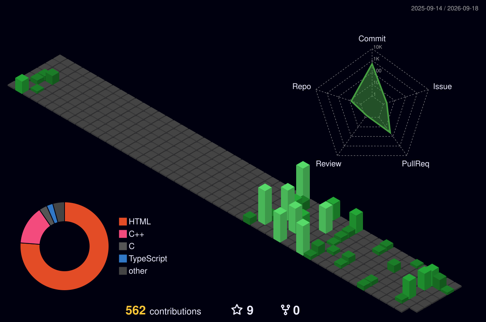

<!--
✨ CCA8798 的 GitHub 个人主页 README
依据 github.com/CCA8798 名下全部 6 个公开仓库的内容,以及博客园教程
《超详细的 GitHub 个人主页美化教程》(https://www.cnblogs.com/PeterJXL/p/18437094) 构建。
统计数据抓取于 2026-09-03(GitHub 公开 API / 博客 RSS)。
修改建议:直接编辑本文件并推送到同名仓库 CCA8798/CCA8798,README.md 即会显示在个人主页。
-->

<div align="center">

# 🍥 不会起名の捌拐玖捌

**aka 捌拐玖捌 · `CCA8798`**

> 一个起名困难的学生开发者,喜欢把脑子里的想法做成能跑起来的东西 ✨


[](https://www.cca8798.com)
[](mailto:2044187229@qq.com)
[](https://x.com/CCA8798)
[](https://github.com/CCA8798?tab=followers)
[](https://github.com/CCA8798)

</div>

---

## 👋 关于我

- 📍 坐标:广东 · 顺德,2022 年底加入 GitHub,陆陆续续攒了 **6 个公开仓库**
- 💻 主力 **C++ / Qt**(Qt 5.14.2 ~ Qt 6.7),深度使用者 [ElaWidgetTools](https://github.com/Liniyous/ElaWidgetTools)(Win11 FluentUI 风格组件库),构建工具 CMake
- 🌐 也折腾 **Web**:基于 [Astro 5](https://astro.build) + [Fuwari](https://github.com/saicaca/fuwari) 自建博客,混合 Svelte / Tailwind / Express
- 🔌 研究过 **frp 内网穿透** 的可视化管理、端口配额、流量统计;写过 Qt 控制台组件库、抽奖工具等桌面玩具
- 🌊 做过海洋保护科普网站(文章 + 数据图表 + 小游戏)—— 初二年级的赛博作业 😄
- 📝 博客:**<https://www.cca8798.com>**(捌拐玖捌的家),自述文件下方有文章同步区
- 📫 邮箱 **2044187229@qq.com**,欢迎交流技术、提 Issue、唠嗑

---

## 📊 GitHub 统计

<p align="center">
  
  
</p>

<p align="center">
  
</p>

<p align="center">
  
</p>

<p align="center">
  
</p>

> 🎯 统计卡片由 [github-readme-stats](https://github.com/anuraghazra/github-readme-stats)、[streak-stats](https://github.com/DenverCoder1/github-readme-streak-stats)、[github-profile-trophy](https://github.com/ryo-ma/github-profile-trophy)、[github-readme-activity-graph](https://github.com/Ashutosh00710/github-readme-activity-graph) 提供,主题、配色可按喜好调整。

---

## 🛠️ 技术栈

**🧠 编程语言**


**🖥️ 桌面开发最爱工具(主战场)**


**🌐 Web / 前端**


**🔧 工具链**


---

## 📦 项目精选(公开 6/6)

> 仓库不多,但每个都是自己从零折腾出来的 —— 欢迎 **Star ⭐** 与 **Issue 📮**!(截至 2026-09-03:共 9 颗星)

<table>
  <tr>
    <td><a href="https://github.com/CCA8798/ConsoleInQt"></a></td>
    <td><a href="https://github.com/CCA8798/SimpleFrpPanel"></a></td>
  </tr>
  <tr>
    <td><a href="https://github.com/CCA8798/Simple_ID_Lottery_ElaVersion"></a></td>
    <td><a href="https://github.com/CCA8798/CCA8798_Blog_Astro_Fuwari"></a></td>
  </tr>
  <tr>
    <td><a href="https://github.com/CCA8798/Ocean-Protection"></a></td>
    <td><a href="https://github.com/CCA8798/Simple_ID_Lottery"></a></td>
  </tr>
</table>

- 🔌 **[ConsoleInQt](https://github.com/CCA8798/ConsoleInQt)** ⭐最多 — Qt Widgets 的 Shell 风格交互式控制台组件库:命令输入 / 静态 + 动态命令 / 样式配置 / 链式流输出(C++17,Qt ≥ 5.12)
- 🚀 **[SimpleFrpPanel](https://github.com/CCA8798/SimpleFrpPanel)** — 基于 Qt + ElaWidgetTools 的 FRP 可视化管理系统:frps / frpc 一键启停、隧道管理、端口配额、按用户 + 隧道 + 日期的流量统计、托盘后台运行
- 🎡 **[Simple_ID_Lottery_ElaVersion](https://github.com/CCA8798/Simple_ID_Lottery_ElaVersion)** — Qt 6 + ElaWidgetTools 桌面抽奖应用:轮盘动画、JSON 名单导入、历史记录持久化
- 📝 **[CCA8798_Blog_Astro_Fuwari](https://github.com/CCA8798/CCA8798_Blog_Astro_Fuwari)** — 本博客源码:Astro 5 + Fuwari,自写粒子背景、实时状态栏(北京时区 + 顺德天气)、全文搜索、Swup 过渡等,部署于 [cca8798.com](https://www.cca8798.com)
- 🐋 **[Ocean-Protection](https://github.com/CCA8798/Ocean-Protection)** — 海洋保护科普网站:科普文章 + 数据图表 + 6 款小游戏(初二年级比赛作业,技术栈 Express 5 + 原生前端)
- 🎲 **[Simple_ID_Lottery](https://github.com/CCA8798/Simple_ID_Lottery)** — C++ 命令行轻量抽奖工具:本地 JSON / Web API 名单、多轮多人数、mt19937 保证公平

---

## ✍️ 最近博客

> 📝 [www.cca8798.com](https://www.cca8798.com) · 📡 [RSS 订阅](https://www.cca8798.com/rss.xml) —— 记录开发日常、Astro 组件与 AI 工具折腾(以下为 RSS 快照,配置 blog-post-workflow 后自动更新)

<!-- BLOG-POST-LIST:START -->
- [Claude连接OpenCode免费模型方法](https://www.cca8798.com/posts/260709_claude%E8%BF%9E%E6%8E%A5opencode%E5%85%8D%E8%B4%B9%E6%A8%A1%E5%9E%8B%E6%96%B9%E6%B3%95/)
- [本站Astro组件开发指南](https://www.cca8798.com/posts/260709_%E6%9C%AC%E7%AB%99astro%E7%BB%84%E4%BB%B6%E5%BC%80%E5%8F%91%E6%8C%87%E5%8D%97/astro_component_reference/)
- [ElaWidgetTools 开发指南](https://www.cca8798.com/posts/260615_elawidgettools%E5%BC%80%E5%8F%91%E6%8C%87%E5%8D%97/)
- [暨南大学附属第一医院就诊&amp;住院记录](https://www.cca8798.com/posts/260506_%E6%9A%A8%E5%8D%97%E5%A4%A7%E5%AD%A6%E9%99%84%E5%B1%9E%E7%AC%AC%E4%B8%80%E5%8C%BB%E9%99%A2%E5%B0%B1%E8%AF%8A%E4%BD%8F%E9%99%A2%E8%AE%B0%E5%BD%95/)
- [用药记录——260506](https://www.cca8798.com/posts/260504_%E7%94%A8%E8%8D%AF%E8%AE%B0%E5%BD%95260506/)
<!-- BLOG-POST-LIST:END -->



---

## 🎨 进阶玩法:动态组件(可选,需 GitHub Actions)

<details>
<summary>🪄 展开查看 —— 贪吃蛇 / 博客自动同步 / 3D 贡献图 的完整配置(灵感来自博客园教程)</summary>

> 本主页的基础徽章、统计卡片、打字机特效都是开箱即用的。想要更"活"的页面,可以任选下面几个 GitHub Actions,把它们保存为 `.github/workflows/xxx.yml` 推送到本仓库(第一次配置完记得在 **Actions** 页手动 `Run workflow` 一次)。

### 🐍 提交记录贪吃蛇动画

`.github/workflows/snake.yml`:

```yaml
name: generate animation

on:
  schedule:
    - cron: "0 */2 * * *"   # 每 2 小时自动更新
  workflow_dispatch:
  push:
    branches:
      - main

jobs:
  generate:
    permissions:
      contents: write
    runs-on: ubuntu-latest
    timeout-minutes: 5

    steps:
      - name: generate github-contribution-grid-snake.svg
        uses: Platane/snk/svg-only@v3
        with:
          github_user_name: ${{ github.repository_owner }}
          outputs: |
            dist/github-contribution-grid-snake.svg
            dist/github-contribution-grid-snake-dark.svg?palette=github-dark

      - name: push to output branch
        uses: crazy-max/ghaction-github-pages@v3.1.0
        with:
          target_branch: output
          build_dir: dist
        env:
          GITHUB_TOKEN: ${{ secrets.GITHUB_TOKEN }}
```

然后在 README 任意位置加入(自动适配明暗主题):

```html
<picture>
  <source media="(prefers-color-scheme: dark)" srcset="https://raw.githubusercontent.com/CCA8798/CCA8798/output/github-contribution-grid-snake-dark.svg">
  <source media="(prefers-color-scheme: light)" srcset="https://raw.githubusercontent.com/CCA8798/CCA8798/output/github-contribution-grid-snake.svg">
  
</picture>
```

### 📚 博客文章自动同步

`.github/workflows/blog-post-workflow.yml`(会替换上方 `<!-- BLOG-POST-LIST:START -->` 与 `<!-- BLOG-POST-LIST:END -->` 之间的内容):

```yaml
name: Latest blog post workflow
on:
  schedule:
    - cron: '0 */2 * * *'
  workflow_dispatch:
permissions:
  contents: write

jobs:
  update-readme-with-blog:
    runs-on: ubuntu-latest
    steps:
      - name: Checkout
        uses: actions/checkout@v7
      - name: Pull in blog's posts
        uses: gautamkrishnar/blog-post-workflow@v1
        with:
          feed_list: "https://www.cca8798.com/rss.xml"
```

### 🧊 3D 贡献图

`.github/workflows/profile-3d.yml`:

```yaml
name: GitHub-Profile-3D-Contrib

on:
  schedule:
    - cron: "0 18 * * *"
  workflow_dispatch:

permissions:
  contents: write

jobs:
  build:
    runs-on: ubuntu-latest
    name: generate-github-profile-3d-contrib
    steps:
      - uses: actions/checkout@v7
      - uses: yoshi389111/github-profile-3d-contrib@v0.9.3
        env:
          GITHUB_TOKEN: ${{ secrets.GITHUB_TOKEN }}
          USERNAME: ${{ github.repository_owner }}
      - name: Commit & Push
        run: |
          git config user.name github-actions
          git config user.email github-actions@github.com
          git add -A .
          git commit -m "generated" || exit 0   # 无变化时跳过,避免报错
          git push
```

跑完后仓库会出现 `profile-3d-contrib/profile-*.svg`,在 README 里用 `` 引用即可。

> ⚠️ 若 Actions 报 `Permission denied` / `403`,请到仓库 **Settings → Actions → General → Workflow permissions** 勾选 **Read and write permissions**。

</details>

---

<p align="center">
  🍥 Made with ❤️ by 不会起名の捌拐玖捌(CCA8798)<br>
  主页美化灵感来自 PeterJXL 的<a href="https://www.cnblogs.com/PeterJXL/p/18437094">《超详细的 GitHub 个人主页美化教程》</a><br>
  统计卡片由 <a href="https://github.com/anuraghazra/github-readme-stats">github-readme-stats</a> 等开源项目驱动 · 感谢每一位来访的你 👋
</p>
